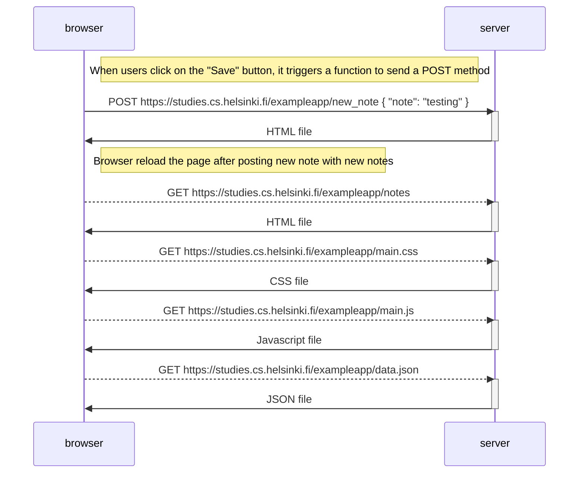

```mermaid
sequenceDiagram
participant browser
participant server

Note right of browser: When users click on the "Save" button, it triggers a function to send a POST method
browser->>server: POST https://studies.cs.helsinki.fi/exampleapp/new_note { "note": "testing" }
activate server
server->>browser: HTML file
deactivate server

Note right of browser: Browser reload the page after posting new note with new notes
browser-->>server: GET https://studies.cs.helsinki.fi/exampleapp/notes
activate server
server->>browser: HTML file
deactivate server

browser-->>server: GET https://studies.cs.helsinki.fi/exampleapp/main.css
activate server
server->>browser: CSS file
deactivate server

browser-->>server: GET https://studies.cs.helsinki.fi/exampleapp/main.js
activate server
server->>browser: Javascript file
deactivate server

browser-->>server: GET https://studies.cs.helsinki.fi/exampleapp/data.json
activate server
server->>browser: JSON file
deactivate server
```
