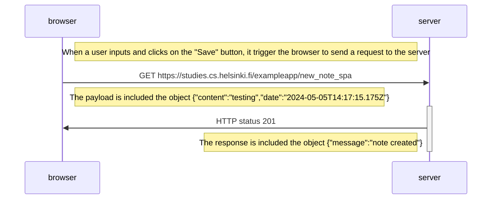

```mermaid
sequenceDiagram
participant browser
participant server

Note right of browser: When a user inputs and clicks on the "Save" button, it trigger the browser to send a request to the server
browser->>server: GET https://studies.cs.helsinki.fi/exampleapp/new_note_spa
Note right of browser: The payload is included the object {"content":"testing","date":"2024-05-05T14:17:15.175Z"}
activate server
server->>browser:  HTTP status 201
Note left of server: The response is included the object {"message":"note created"}
deactivate server
```
